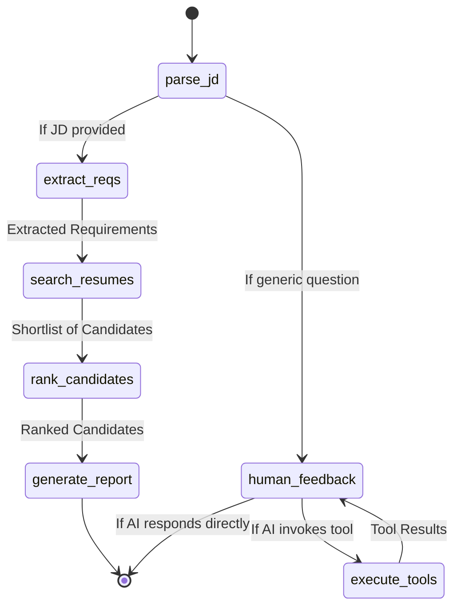

# 🤝 Agentic Profile Matching System

An intelligent, conversational recruitment assistant built with **LangGraph**, **LangChain**, **OpenAI GPT**, **ChromaDB**, and **Streamlit**. It uses a multi-node AI agent to parse job descriptions, semantically search a resume database, rank candidates, and generate detailed match reports — all through a natural chat interface.

---

## 📋 Table of Contents

- [Features](#-features)
- [Architecture Overview](#-architecture-overview)
- [Agent Workflow](#-agent-workflow)
- [Project Structure](#-project-structure)
- [Tech Stack](#-tech-stack)
- [Prerequisites](#-prerequisites)
- [Installation](#-installation)
- [Configuration](#-configuration)
- [Running the App](#-running-the-app)
- [How to Use](#-how-to-use)
- [Available Tools](#-available-tools)
- [Mock Data / Candidate Database](#-mock-data--candidate-database)
- [Test Scenarios](#-test-scenarios)
- [File Reference](#-file-reference)

---

## ✨ Features

- 🧠 **Agentic AI Pipeline** — LangGraph-powered stateful agent with conditional routing
- 🔍 **RAG-based Resume Search** — Semantic search over resumes using ChromaDB vector store
- 📊 **Automated Candidate Ranking** — GPT ranks candidates from best to worst match
- 📝 **Explainable Match Reports** — Detailed reports with strengths, gaps & suggestions
- 💬 **Conversational Interface** — Follow-up questions, comparisons, and refinements
- 🛠️ **Tool Use** — Agent can call tools to compare candidates or generate interview questions
- 🔒 **Secure Key Management** — API key stored in `.env`, never hardcoded

---

## 🏗️ Architecture Overview

```
User Input (Streamlit UI)
        │
        ▼
  ┌─────────────────────────────────────────────┐
  │              LangGraph Agent                │
  │                                             │
  │  parse_jd ──► extract_reqs ──► search_resumes
  │     │                               │       │
  │     │                          rank_candidates
  │     │                               │       │
  │     │                         generate_report│
  │     │                                       │
  │     └──► human_feedback ◄──► execute_tools  │
  └─────────────────────────────────────────────┘
        │
        ▼
  ChromaDB (Vector Store)
  sentence-transformers (Embeddings)
  OpenAI GPT (LLM)
```

---

## 🔄 Agent Workflow

The agent uses a **state machine** with 7 nodes:



### Node Descriptions

| Node | Description |
|------|-------------|
| `parse_jd` | Entry point. Classifies input as a Job Description or a conversational query |
| `extract_reqs` | Uses GPT structured output to extract **must-have** and **nice-to-have** requirements |
| `search_resumes` | Queries ChromaDB vector store via RAG to return matching candidate shortlist |
| `rank_candidates` | Passes shortlist + requirements to GPT to rank candidates best → worst |
| `generate_report` | Deep analysis of top 3 candidates with strengths, gaps, and suggestions |
| `human_feedback` | Conversational node with full tool access for follow-up questions |
| `execute_tools` | LangGraph `ToolNode` that executes AI-requested tool calls |

---

## 📁 Project Structure

```
Agentic Profile Matching/
│
├── app.py                  # Streamlit UI — main entry point
├── matching_agent.py       # LangGraph agent definition (nodes + edges)
├── tools.py                # LangChain tools (search, compare, interview Qs)
├── vector_store.py         # ChromaDB init and resume indexing
├── state.py                # AgentState TypedDict definition
├── llm_config.py           # OpenAI LLM factory (reads from .env)
├── mock_data.py            # Generates 10 synthetic candidate JSON resumes
│
├── .env                    # 🔑 API key config (YOU MUST EDIT THIS)
├── .gitignore              # Excludes .env, venv, __pycache__, chroma_db
├── requirements.txt        # Python dependencies
│
├── data/
│   └── resumes/            # Auto-generated JSON resume files
│       ├── cand_001.json
│       ├── cand_002.json
│       └── ...
│
├── chroma_db/              # Auto-generated ChromaDB vector store
├── state_machine_diagram.md
└── test_scenarios.md
```

---

## 🛠️ Tech Stack

| Component | Technology |
|-----------|-----------|
| **LLM** | OpenAI GPT-4o-mini (configurable) |
| **Agent Framework** | LangGraph + LangChain |
| **Vector Store** | ChromaDB (persistent, local) |
| **Embeddings** | `sentence-transformers/all-MiniLM-L6-v2` |
| **UI** | Streamlit |
| **Language** | Python 3.12 |
| **Config** | python-dotenv |

---

## 📦 Prerequisites

- Python **3.10+**
- An **OpenAI API key** (get one at [platform.openai.com/api-keys](https://platform.openai.com/api-keys))
- `pip` and `venv`

---

## ⚙️ Installation

### 1. Clone the repository

```bash
git clone <your-repo-url>
cd "Agentic Profile Matching"
```

### 2. Create and activate a virtual environment

```bash
python3 -m venv venv
source venv/bin/activate        # Linux / macOS
# venv\Scripts\activate         # Windows
```

### 3. Install dependencies

```bash
pip install -r requirements.txt
```

---

## 🔑 Configuration

Open the `.env` file and add your OpenAI API key:

```env
OPENAI_API_KEY=sk-proj-xxxxxxxxxxxxxxxxxxxxxxxxxxxxxxxx
OPENAI_MODEL=gpt-4o-mini
```

> **Get your key:** [platform.openai.com/api-keys](https://platform.openai.com/api-keys)
>
> `gpt-4o-mini` is the recommended model — fast, accurate, and very cost-effective (~$0.15 / 1M input tokens).
> You can change to `gpt-4o` for higher quality if needed.

> ⚠️ **Never commit your `.env` file.** It is already listed in `.gitignore`.

---

## 🚀 Running the App

### Step 1 — Generate mock resume data & index into ChromaDB

You only need to do this **once**:

```bash
python mock_data.py       # Creates JSON resumes in data/resumes/
python vector_store.py    # Indexes resumes into ChromaDB
```

Or use the **"Generate Mock Resumes & Index DB"** button inside the app.

### Step 2 — Launch the Streamlit app

```bash
streamlit run app.py
```

Open your browser at **http://localhost:8501**

> ❌ Do NOT run `python app.py` — Streamlit apps require `streamlit run app.py`

---

## 💬 How to Use

### Starting a Job Description Search

Paste or type a job description into the chat box. The agent will automatically:

1. Parse and classify it as a JD
2. Extract must-have and nice-to-have requirements
3. Search the resume database semantically
4. Rank all matching candidates
5. Generate a detailed match report for the top 3

**Example input:**
```
We are looking for a Senior React Developer.
Must have: 5+ years of experience, React, TypeScript, Next.js.
Nice to have: Node.js, AWS.
```

### Follow-up Conversational Queries

After a search, you can ask natural language follow-up questions:

```
Compare cand_001 and cand_005 for a Lead Full Stack role.
Generate interview questions for cand_006.
Does Fiona know SQL?
Who has the most AWS experience?
```

### Sidebar Panel

The right-hand sidebar shows live agent state:
- 📝 **Extracted Requirements** — must-have and nice-to-have skills
- 🏆 **Candidate Shortlist** — ranked candidate names and titles
- 📊 **Latest Report** — the full match analysis report
- ⚙️ **Configuration** — API key status and active model

---

## 🔧 Available Tools

The agent can invoke these tools during conversation:

| Tool | Description |
|------|-------------|
| `search_resumes_rag` | Semantic search over the ChromaDB resume vector store |
| `read_resume_file` | Reads the full JSON resume for a given candidate ID |
| `extract_requirements` | Extracts structured must-have / nice-to-have from a JD |
| `compare_candidates` | Head-to-head comparison of 2+ candidates by ID |
| `generate_interview_questions` | Generates 5 technical + 2 behavioral questions for a candidate |

---

## 👥 Mock Data / Candidate Database

10 synthetic candidates are included out of the box:

| ID | Name | Title | Experience | Key Skills |
|----|------|-------|------------|-----------|
| cand_001 | Alice Smith | Senior Frontend Engineer | 5 yrs | React, TypeScript, Next.js, Redux |
| cand_002 | Bob Jones | Full Stack Developer | 3 yrs | Vue.js, Python, Django, PostgreSQL |
| cand_003 | Charlie Brown | Backend Engineer | 6 yrs | Java, Spring Boot, Microservices, AWS |
| cand_004 | Diana Prince | React Developer | 2 yrs | React, JavaScript, Tailwind |
| cand_005 | Evan Wright | Lead Software Engineer | 8 yrs | React, Node.js, AWS, GraphQL |
| cand_006 | Fiona Gallagher | Data Scientist | 4 yrs | Python, ML, TensorFlow, SQL |
| cand_007 | George Miller | Frontend Developer | 4 yrs | Angular, TypeScript, RxJS |
| cand_008 | Hannah Abbott | DevOps Engineer | 5 yrs | Docker, Kubernetes, CI/CD, Terraform |
| cand_009 | Ian Malcolm | Senior React Native Engineer | 6 yrs | React Native, TypeScript, Redux |
| cand_010 | Jane Doe | Junior Web Developer | 1 yr | HTML, CSS, JavaScript, React |

---

## 🧪 Test Scenarios

### Scenario 1: Standard End-to-End Match
**Input:**
```
We are looking for a Senior React Developer. Must have 5+ years of experience 
with React, TypeScript, and Next.js. Nice to have: Node.js and AWS.
```
**Expected:** Agent extracts requirements → searches ChromaDB → ranks candidates → generates report highlighting Alice Smith and Evan Wright.

---

### Scenario 2: Iterative Refinement
**Input (follow-up):**
```
Actually, drop the Next.js requirement and focus on someone with strong Python 
backend skills along with React.
```
**Expected:** Agent acknowledges the update and re-searches with new criteria.

---

### Scenario 3: Head-to-Head Comparison
**Input:**
```
Compare cand_001 (Alice) and cand_005 (Evan) for a Lead Full Stack role.
```
**Expected:** Agent calls `compare_candidates(["cand_001", "cand_005"])` and returns a verdict (Evan's 8 years vs Alice's 5 years).

---

### Scenario 4: Interview Question Generation
**Input:**
```
Generate interview questions for cand_006 (Fiona).
```
**Expected:** Agent calls `generate_interview_questions("cand_006")` and returns 5 technical + 2 behavioral questions tailored to her data science background.

---

### Scenario 5: Vague Requirements
**Input:**
```
Find me someone good with data.
```
**Expected:** Agent searches for "data" skills → finds Fiona Gallagher (Data Scientist). User can follow up: *"Does she know SQL?"*

---

## 📄 File Reference

| File | Purpose |
|------|---------|
| `app.py` | Streamlit UI, session state management, agent invocation |
| `matching_agent.py` | LangGraph `StateGraph` with all nodes, edges, and routing logic |
| `tools.py` | Five `@tool`-decorated LangChain functions available to the agent |
| `vector_store.py` | ChromaDB client setup and resume document indexing |
| `state.py` | `AgentState` TypedDict — the shared state passed between all nodes |
| `llm_config.py` | `get_llm()` factory — reads `OPENAI_API_KEY` and `OPENAI_MODEL` from `.env` |
| `mock_data.py` | Generates 10 synthetic candidate JSON files in `data/resumes/` |
| `.env` | **Edit this** — store your `OPENAI_API_KEY` here |
| `.gitignore` | Excludes `.env`, `venv/`, `chroma_db/`, `__pycache__/` |
| `requirements.txt` | All Python package dependencies |
| `state_machine_diagram.md` | Mermaid diagram of the agent workflow |
| `test_scenarios.md` | 5 example conversation flows for testing |

---

## 🤝 Contributing

1. Fork the repo
2. Create a feature branch: `git checkout -b feature/my-feature`
3. Commit your changes: `git commit -m "Add my feature"`
4. Push to the branch: `git push origin feature/my-feature`
5. Open a Pull Request

---

## 📜 License

This project is licensed under the MIT License.
# Agentic_profile_matching
