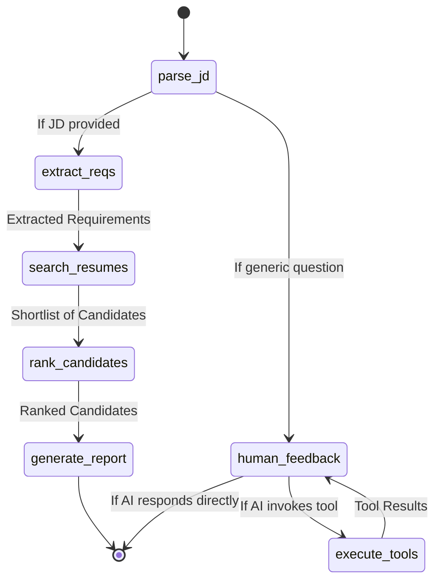

# Agent Workflow State Machine

This diagram illustrates the state machine for the LangGraph-based Agentic Profile Matching system.

### Node Descriptions

1. **parse_jd**: The entry point. It evaluates the user's input to determine if it is a new Job Description (JD) or a conversational query/question.
2. **extract_reqs**: Uses structured output from the LLM to extract "must-have" and "nice-to-have" requirements from the JD.
3. **search_resumes**: Calls the `search_resumes_rag` tool to query the ChromaDB vector store and return a shortlist of candidates matching the requirements.
4. **rank_candidates**: Passes the shortlist and the requirements to the LLM to rank the candidates from best match to worst match.
5. **generate_report**: Deeply analyzes the top 3 candidates and generates a comprehensive report highlighting strengths, gaps, and improvement suggestions.
6. **human_feedback**: The conversational interface node. It has access to tools like `compare_candidates` and `generate_interview_questions` to answer specific user queries about the candidates.
7. **execute_tools**: A LangGraph `ToolNode` that physically executes any tool calls requested by the `human_feedback` node and returns the results back to it.
